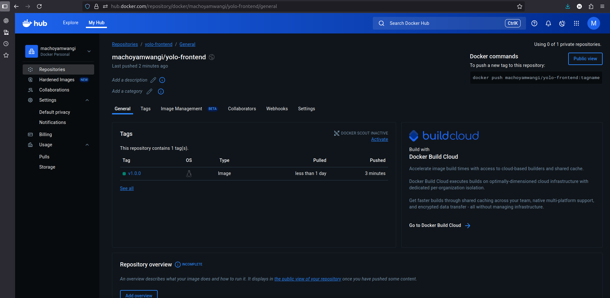
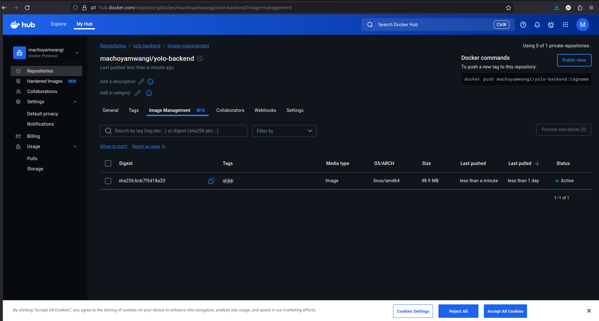

# explanation.md

## Project
**YOLO Web App** — front-end + back-end JavaScript application, backed by MongoDB, deployed via Docker / Docker Compose and (optionally) pushed to a registry for CI/CD deployment.

---

## Purpose of this document
This file explains the implementation choices made while containerizing and composing the application. It expands on the reasoning for the key objectives listed by the maintainer: base image choices, Dockerfile directives, networking (ports & bridge network), volumes, Git workflow, successful run / debugging, and Docker image naming/tagging best practices.

---

## 1) Choice of the base image on which to build each container
**Backend (API / Node/Express)**
- **Chosen image:** `node:18-alpine` 

- **Reasoning:** Alpine-based images are much smaller which reduces build/pull time and attack surface. Node LTS (18) ensures predictable compatibility with modern packages. 

**Frontend (React build)**
- **Build stage:** Use `node:18-alpine` for building (fast npm/yarn install + build).
- **Runtime stage:** Serve static files with `alpine:3.16.7` (small, battle-tested performance for static content). Using a tiny web server reduces attack surface and memory usage compared to running a Node server just for static files.

**Database**
- **Chosen image:** Official `mongo:6.0` 
- **Reasoning:** Official images are maintained, predictable, and include necessary tooling.

**Reverse proxy (if used)**
- **Image:** `alpine:3.16.7` (lightweight, performant)

---

## 2) Dockerfile directives used in the creation and running of each container
A few directives and patterns were prioritized to create secure, cache-friendly, and small images:

- `FROM` – selects the base image. Multistage builds use multiple `FROM` lines (e.g., build stage + runtime stage) to keep runtime images minimal.
- `WORKDIR` – creates a working directory to avoid `RUN cd ...` anti-pattern.
- `COPY` – copy only necessary files; 
- `RUN` – install dependencies and build assets. Combine package management steps into a single `RUN` to reduce layers (but keep readability).
- `EXPOSE` – documents which port the container listens on (does not publish it by itself).
- `ENTRYPOINT` vs `CMD` – `ENTRYPOINT` for the executable (e.g., an app start script); `CMD` for default args so compose or `docker run` can override them.

**Multistage example (short):**

```dockerfile
# build stage
FROM node:18-alpine AS build
WORKDIR /app
COPY package*.json ./
RUN npm install

COPY . .
RUN npm run build

# runtime stage (static site)
FROM alpine:3.16.7
COPY --from=build /usr/src/app /app
EXPOSE 3000
CMD ["npm", "start"]
```

**Good practices used:**
- small, single-purpose layers
- pinned package versions where possible
- `.dockerignore` to speed builds
- add metadata labels (`org.opencontainers.image.*`) for clarity

---

## 3) Docker Compose networking (Application port allocation and bridge network implementation)
**Port allocation**
- Map container ports to host ports in `docker-compose.yml` using `ports:` (e.g., `"3000:3000"` for backend). Pick host ports that do not collide with other local services. Use environment variables to make the host port configurable.

**Bridge network**
- Compose creates a default bridge network where service names act as DNS hostnames. This means the backend can reach the database at `mongo:27017` if the service is named `mongo` in compose.
- For isolation and control, we define a custom bridge network in compose. This makes it explicit which services belong to the same network and allows custom network configuration (subnet, driver options) if needed.

**Example snippet:**

```yaml
services:
  backend:
    build: ./backend
    ports:
      - "5000:5000"
    networks:
      - yolonet
    depends_on:
      - mongo
  frontend:
    build: ./client
    ports:
      - "3000:3000"
    networks:
      - yolonet
  mongo:
    image: mongo:6.0
    volumes:
      - mongo-data:/data/db
    networks:
      - yolonet

networks:
  yolonet:
    driver: bridge

volumes:
  mongo-data:
```

**Why a custom bridge?**
- Makes the network explicit in the compose file (easier to reason about and document). Services can only communicate if attached to the same network, which is a light security boundary.

---

## 4) Docker-compose volume definition and usage
**Where volumes are used**
- **Persistent DB storage:** A named volume (`mongo-data`) stores MongoDB data so it persists across container recreations.
- **Developer mounts (optional):** During development we use bind mounts (`./backend:/app`) to instantly reflect code changes, and optionally mount `node_modules` as an anonymous or named volume to avoid permission issues.

**Why named volumes for DB?**
- Named volumes are managed by Docker and are appropriate for production-like persistence. They avoid coupling container filesystem layout to the host.

**Example:**

```yaml
volumes:
  mongo-data:

services:
  mongo:
    image: mongo:6.0
    volumes:
      - mongo-data:/data/db
```

**File permission notes**
- If using bind mounts on Linux, ensure UID/GID align to avoid permission errors. Consider `chown` during image build or use an entrypoint script to handle ownership.

---

## 5) Git workflow used to achieve the task
**Branching model & conventions**
- `master` holds production-ready code.

**Commits & messages**
- Use small, atomic commits. Follow a conventional format (`feat:`, `fix:`, `chore:`) for clarity and release automation.

**CI/CD integration**
- CI pipeline builds Docker images on PR and pushes to the registry on merge to `master`. Use CI environment secrets for registry credentials, DB connection strings for staging, and not commit `.env` to repo.
- Tagging strategy: create annotated Git tags on releases (e.g., `v1.2.0`) and mirror tags to container images.

**Example commands used during development**

```bash
# work and commit
git add .
git commit -m "add Dockerfile for backend"
# push and open PR
git push 
```

---

## 6) Successful running of the applications and debugging measures applied
**Run steps used to verify**
1. `docker-compose up --build` — start all services and build images.
2. `docker-compose ps` — verify containers are running.
3. `docker-compose logs -f backend` — follow logs during startup.
4. Healthchecks and quick smoke tests: `curl http://localhost:3000/health`.

**Common issues & resolutions**
- **Port conflict:** If `3000` already in use, change host mapping (e.g., `3001:3000`) or stop the conflicting service.
- **DB connection refused:** Ensure `MONGO_URI` points to `mongodb://mongo:27017/dbname` and service `mongo` is up; use `depends_on` and `healthcheck` to sequence start.
- **Missing env vars:** Ensure `.env` values are provided to compose (use `env_file:` or CI secrets).
- **Permission errors with mounted volumes:** Fix ownership (e.g., `chown -R 1000:1000`) or adjust Dockerfile `USER`.
- **Cache causing stale builds:** `docker-compose build --no-cache` or `docker builder prune`.

**Debugging tools**
- `docker exec -it <container> /bin/sh` to inspect filesystem and run commands.
- `docker logs <container>` for startup/runtime errors.
- `docker-compose run --rm backend sh` to run one-off commands like migrations.

---

## 7) Good practices such as Docker image tag naming standards
**Tagging conventions**
- Use structured tags: `registry/namespace/repo:service-semver` or `registry/namespace/service:1.2.0`.
  - Example: `ghcr.io/machoyamwangi/yolo-backend:1.0.0` and `ghcr.io/machoyamwangi/yolo-backend:latest`
- Use semantic versioning for releases: `vMAJOR.MINOR.PATCH` Git tags mirrored to image tags.
- Use additional tags for CI builds: `service:branch-commitsha` (e.g., `yolo-backend:main-7f2d3c4`) to trace images back to commits.

**Immutability & reproducibility**
- Keep stable release images immutable by tagging with release versions; use `latest` only as a convenience tag.
- Pin base image versions where possible to avoid broken builds when upstream images change.

---

## Appendix: Useful commands
- Build & run: `docker-compose up --build --remove-orphans`
- Rebuild without cache: `docker-compose build --no-cache`
- View logs: `docker-compose logs -f`
- Exec shell: `docker-compose exec backend sh`
- Prune unused: `docker image prune -af && docker volume prune -f`

## Screenshots

### Frontend


### Backend Logs


---
